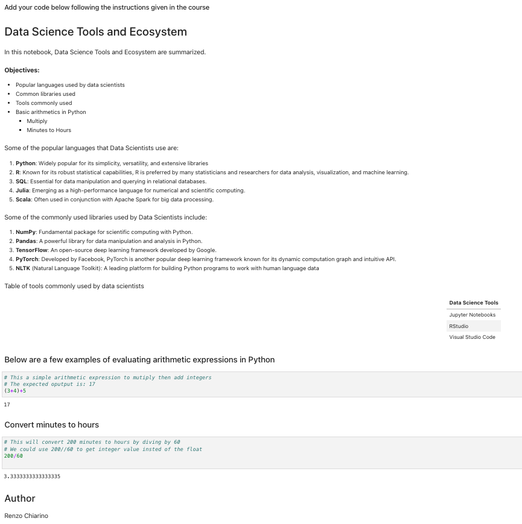
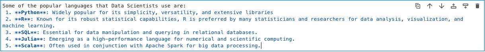
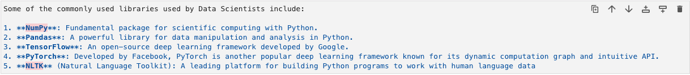
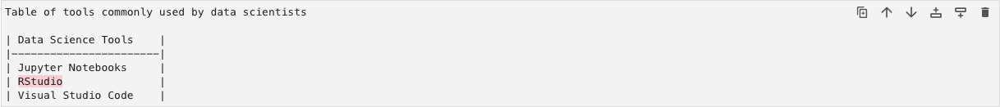
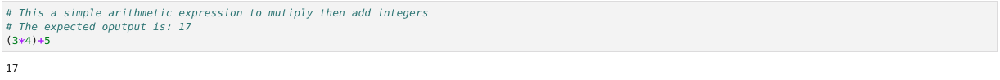
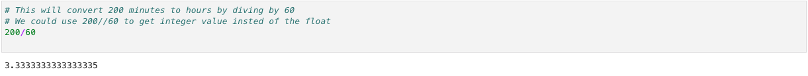
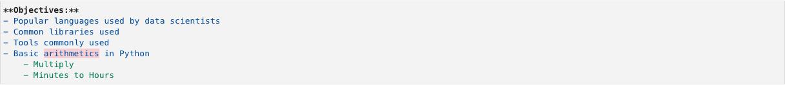

# final-assignment-tools-for-data-science

In this repository is all the files and notebook for the final assignment of the course Tools for Data Science.

## Notebook

[My Notebook](./DataScienceEcosystem.ipynb)

### Notebook Preview

## Images

All the screenshots of the notebook are in the folder [images](/images/).

The following list of images correspond to the screenshots of the notebook:

